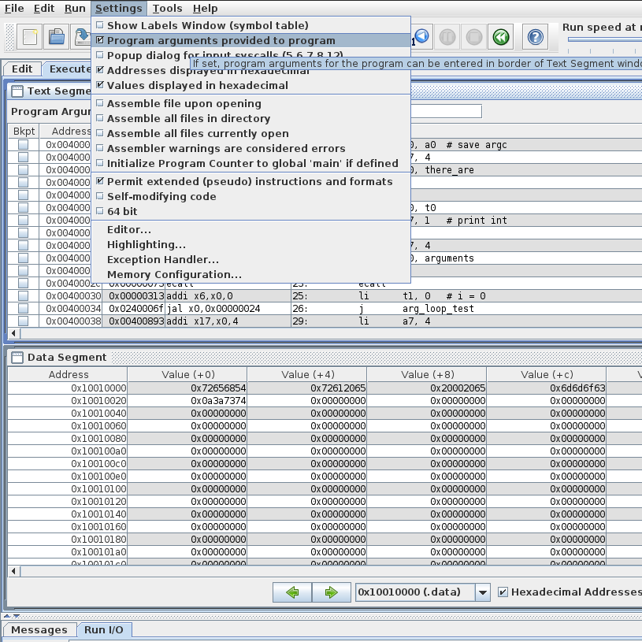
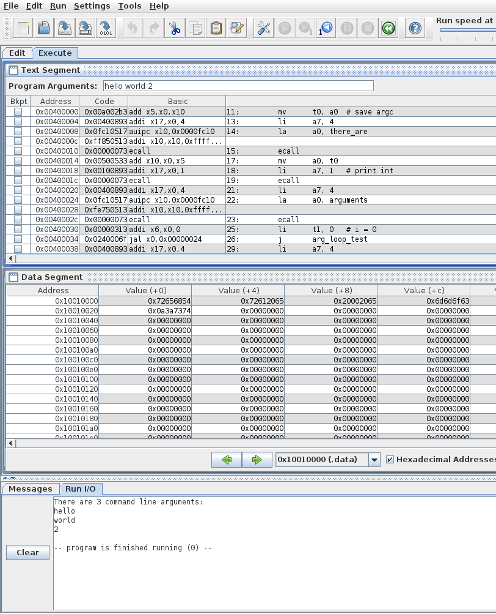

:source-highlighter: pygments

:green_tabs: footnote:[When I find the post I read years ago about how using tabs saves CO2 I'll put it here, but I'm joking.  I use tabs because it makes sense and there are accessibility reasons too: https://www.reddit.com/r/javascript/comments/c8drjo/nobody_talks_about_the_real_reason_to_use_tabs/]

:label_addresses: footnote:[https://gcc.gnu.org/onlinedocs/gcc/Labels-as-Values.html]

== Chapter 7: Tips and Tricks

This chapter is a grab bag of things you can do to improve your RISC-V
programs and make your life easier.

=== Formatting

You may have noticed I have a general format I like to follow when writing
RISC-V (or any) assembly.  The guidelines I use are the following

. *1 indent for all code excluding labels/macros/constants.*
+
I use hard tabs set to a width of 4 but it really doesn't matter as long as
it's just 1 indent according to your preferences.

. *Use _spaces_ to align the first operand of all instructions out far enough.*
+
Given my 4 space tabs, this means column 13+ (due to longer floating point
instructions like fcvt.s.w, though I often stop at 10 or 11 when that's sufficient).
The reason to use spaces is to prevent the circumstances that gave
hard tabs a bad name.  When you use hard tabs for alignment, rather than indentation,
and then someone else opens your code with their tab set to a different width,
suddenly everything looks terrible.  Thus, tabs for indentation, spaces for alignment.
Or as is increasingly common (thanks Python), spaces for everything but I refuse
to do that to the poor planet.{green_tabs}

. *A comma and a single space between operands.*
+
The simulators don't actually require the comma but since other assembly
languages/assemblers do, you might as well get used to it.  Besides I think
it's easier to read with the comma, though that might be me comparing it
to passing arguments to a function.

. *Comment every line or group of closely related lines with the purpose.*
+
This is often simply the equivalent C code.  You can relax this a little as you get
more experience.

. *Use a blank line to separate logically grouped lines of code.*
+
While you can smash everything together vertically, I definitely wouldn't recommend
it, even less than I would in a higher level language.

. *Put the `.data` section at the top, similar to declaring globals in C.*
+
There are exceptions for this.  When dealing with a larger program with lots
of strings, it can be convenient to have multiple `.data` sections with the
strings you're using declared close to where you use them.  The downside is
you have to keep swapping back and forth between `.text` and `.data`.

=== Misc. General Tips

. *Try to use registers starting from 0 and working your way up.*
+
It helps you keep track of where things are (esp. combined with the comments).
This can fall apart when you discover you forgot something or need to
modify the code later and it's often not worth changing all the registers
you're already using so you can maintain that nice sequence.  When that happens
I'll sometimes just pick the other end of sequence (ie `t6`, `a7`, or `s11`) since
if it's out of order I might as well make it obvious.

. *Minimize your jumps, labels, and especially your level of nested loops.*
+
This was already covered in the chapters on branching and loops but it bears
repeating.

. *In your prologue save `ra` first, if necessary, then all s regs used starting at `s0`.*
+
Then copy paste the whole thing to the bottom, move the first line to the bottom and
change the number to positive and change all the `sw` to `lw`.

....
func:
	addi     sp, sp, -20
	sw       ra, 0(sp)
	sw       s0, 4(sp)
	sw       s1, 8(sp)
	sw       s2, 12(sp)
	sw       s3, 16(sp)

	# body of func here that calls another function or functions
	# and needs to preserve 4 values across at least one of those calls

	lw       ra, 0(sp)
	lw       s0, 4(sp)
	lw       s1, 8(sp)
	lw       s2, 12(sp)
	lw       s3, 16(sp)
	addi     sp, sp, 20
....

=== Constants

One of the easiest things you can do to make your programs more readable
is to use defined constants in your programs.  RARS has a way of defining
constants similar to how C defines macro constants; ie they
aren't "constant variables" that take up space in memory, it's as if a
search+replace was done on them right before assembling the program.

Let's look at our Hello World program using constants:

[source,riscv,linenums]
----
.eqv sys_print_str 4
.eqv sys_exit 10

.data
hello:   .asciz "Hello World!\n"

.text
main:
	li   a7, sys_print_str
	la   a0, hello  # load address of string to print into a0
	ecall

	li   a7, sys_exit
	ecall
----

=== Macros

RARS supports function style macros that can shorten your code and improve
readability in some cases (though I feel it can also make it worse or be a wash).

The syntax looks like this:

[source,riscv,linenums]
----
.macro macroname
	instr1  a, b, c
	instr2, b, d
# etc.
.end_macro

# or with parameters
.macro macroname(%arg1)
	instr1    a, %arg1
	instr2    c, d, e
# etc.
.end_macro
----

Some common examples are using them to print strings:

[source,riscv,linenums]
----
.macro print_str_label(%x)
	li     a7, 4
	la     a0, %x
	ecall
.end_macro

.macro print_str(%str)
.data
str: .asciz %str
.text
	li     a7, 4
	la     a0, str
	ecall
.end_macro

.data

str1:   .asciz "Hello 1\n"

.text
# in use:
	print_str_label(str1)

	print_str("Hello World\n")

	...
----

You can see an example program in
https://raw.githubusercontent.com/rswinkle/riscv_book/master/code/macros.s[macros.s].

=== Switch-Case Statements

It is relatively common in programming to compare an integral type variable
(ie basically any built-in type but float and double) against a bunch of different
constants and do something different based on what it matches or if it matches none.

This could be done with a long `if-else-if` chain, but the longer the chain the more
likely the programmer is to choose a `switch-case` statement instead.

Here's a pretty short/simple example in C:

[source,c,linenums]
----
	printf("Enter your grade (capital): ");
	int grade = getchar();
	switch (grade) {
	case 'A': puts("Excellent job!"); break;
	case 'B': puts("Good job!"); break;
	case 'C': puts("At least you passed?"); break;
	case 'D': puts("Probably should have dropped it..."); break;
	case 'F': puts("Did you even know you were signed up for the class?"); break;
	default: puts("You entered and invalid grade!");
	}
----

You could translate this to its eqivalent `if-else` chain and handle it like we
cover in the chapter on branching.  However, imagine if this switch statment had
a dozen cases, two dozen etc.  The RISC-V code for that quickly becomes long and ugly.

So what if we implemented it in RISC-V the same way it is semantically in C?
The same way compilers often (but not necessarily) use?  Well, before we do that,
what is a switch actually doing?  It is _jumping_ to a specific case label based
on the value in the specified variable.  It then starts executing, falling through
any other labels, till it hits a `break` which will jump to the end of the switch
block.  If the value does not have its own case label, it will jump to the default
label.

Compilers handle it by creating what's called a jump table, basically an array
of label addresses, and using the variable to calculate an index in the table
to use to jump to.

The C eqivalent of that would look like this:

[source,c,linenums]
----
include::code/switch.c[]
----

The `&&` and `goto *var` syntax are actually not standard C/C++ but are GNU
extensions that are supported in gcc (naturally) and clang, possibly others.{label_addresses}

First, notice how the size of the jump table is the value of the highest valued label
minus the lowest + 1.  That's why we subtract the lowest value to shift the range
to start at 0 for the indexing.  Second, any values without labels within that range
are filled with the `default_label` address.  Third, there has to be an initial
check for values outside the range to jump to default otherwise you could get an
error from an invalid access outside of the array's bounds.

The same program/code in RISC-V would look like this:

[source,riscv,linenums]
----
include::code/switch.s[]
----

You can see we can use the pseudoinstruction `jr` (jump register) to do the eqivalent
of the computed goto statement in C.

This example probably wasn't worth making switch style, because the overhead
and extra code of making the table and preparing to jump balanced out or even
outweighed the savings of a branch instruction for every case.  However, as the
number of options increases, the favor tilts toward using a jump table like this as
long as the range of values isn't too sparse.  If the range of values is in the 100's
or 1000's but you only have cases for a dozen or so, then obviously it isn't worth
creating a table that large only to fill it almost entirely with the default label
address.

To reiterate, remember it is not about the magnitude of the actual values
you're looking for, only the difference between the highest and lowest because
high - low + 1 is the size of your table.

=== Command Line Arguments

Command line arguments, also known as program arguments, or command line parameters,
are strings that are passed to the program on startup.  In high level languages like
C, they are accessed through the parameters to the main function (naturally):

[source,c,linenums]
----
#include <stdio.h>

int main(int argc, char** argv)
{
	printf("There are %d command line arguments:\n", argc);

	for (int i=0; i<argc; i++) {
		printf("%s\n", argv[i]);
	}

	return 0;
}
----

As you can see, `argc` contains the number of parameters and `argv` is an array of
those arguments as C strings.  If you run this program you'll get something
like this:

[source,bash]
----
$ ./args 3 random arguments
There are 4 command line arguments:
./args
3
random
arguments
----

Notice that the first argument is the what you actually typed to invoke the program,
so you always have at least one argument.

RISC-V works the same way.  The number of arguments is in `a0` and an array of strings
is in `a1` when main starts.  So the same program in RISC-V looks like this:

[source,riscv,linenums]
----
include::code/args.s[]
----

Unfortunately, RARS works slightly differently, probably because it's more GUI focused.
It does not pass the program/file name as the first argument, so you can actually get
0 arguments:

[source]
----
$ java -jar ~/rars_latest.jar args.s pa 3 random arguments
RARS 1.5  Copyright 2003-2019 Pete Sanderson and Kenneth Vollmar

There are 3 command line arguments:
3
random
arguments

Program terminated by calling exit
----

You can see that you have to pass "pa" (for "program arguments") to indicate that
the following strings are arguments.  In the GUI, there is an option in
"Settings" called "Program arguments provided to progam" which if selected will
add a text box above the Text Segment for you to enter in the arguments to be
passed.

.Enable program arguments in RARS GUI

.Example using program arguments in RARS GUI

=== No Pseudoinstructions Allowed

One relatively common assignment requirement is forbidding pseudoinstructions,
either all of them, or some subset of them.  This forces us to explicitly write
what those pseudoinstructions are translated into (or could be translated into
since there are often several alternatives).

ifndef::is_pdf[]
include::pseudo_equivalents.adoc[]
endif::[]

ifdef::is_pdf[]
include::pseudo_equivalents_pdf.adoc[]
endif::[]

You can see how you use the non-pseudoinstructions to match the same behavior, and
there's often (usually) more than one way.  Of all of them, `ble` is
the worst, because what was 1 instruction becomes 3, and you'll sometimes need an
extra register to hold the "plus 1" value if you still need the original.

Another thing I should comment on is the `la` equivalence.  The reason it is
a pseudoinstruction in the first place is that an address is 32 bits.  That's also
the size of a whole instruction.  Clearly there's no way to represent a whole
address and anything else at the same time.  The lower right corner of the
greensheet has the actual formats of the 6 different types of instructions and
even the U and UJ formats still needs 12 bits for the opcode and destination.
This is why `lui` (and `auipc`) exists,
in order to facilitate getting a full address into a register by doing it in two
halves, 20 + 12.  The lower 12 can be placed with `addi` or `ori` after the `lui`.

NOTE: RARS actually uses `auipc` not `lui` probably because that's what the RISC-V
spec says (also see top left on page 2 of the greensheet). They both can accomplish
the same thing but the former is needed for PC-relative addressing which whereas
lui is 0/absolute addressing. Since RARS works with absolute addressing the easier
to use `lui` is fine.

That begs the question, what actually goes in the upper half?  Well, since
we're dealing with addresses in the `.data` section, the upper portion should
match the upper part of address of the `.data` section.  In RARS it is always
`0x10010000`.

But what about the lower part of the address?  This involves counting the bytes
from the top of `.data` to the label you want.  If all you have is words, halfs,
floats, doubles, or space (with a round number), that's fairly easy, but the
second you have strings between the start and the label you want, it's a bit
more painful.  This is why I recommend putting any string declarations at the
bottom so at least any other globals will have nice even offsets.  Also, if
you have a bunch of globals, it doesn't hurt to count once and put the offsets
in comments above each label so you don't forget.  Of course, none of this matters
if you're allowed to just use `la` which is true the vast majority of the time.

Let's look at a small example.  We'll convert the args.s from above (reproduced
here for convenience) to bare mode:

[source,riscv,linenums]
----
include::code/args.s[]
----

So we need to change the `mv`, the ``li``'s, the `j`, and the `la`.

[source,riscv,linenums]
----
include::code/args_bare.s[]
----

Following the table, you can see the `mv` became `or`, the `li` became
`ori`, the `j` became `jal` with `x0` as the destination register,
and lastly the `la` became `lui` plus an `ori` if necessary for the byte offset.
